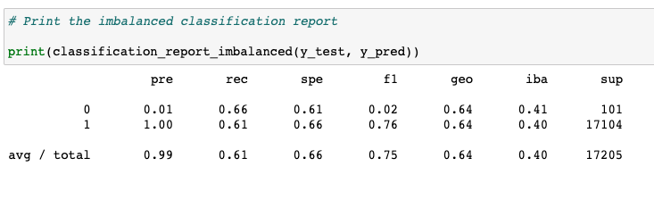
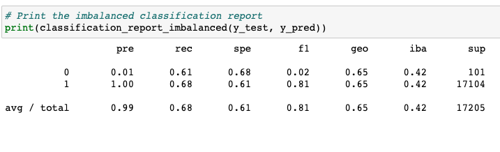
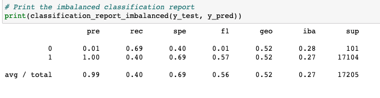
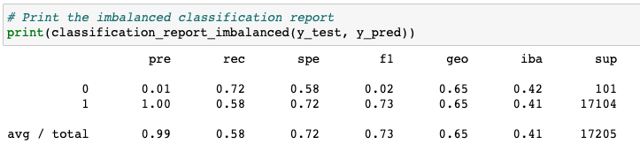
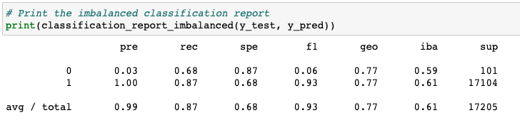
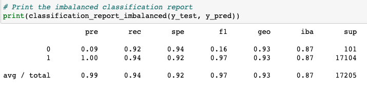

# Credit_Risk_Analysis
Supervised Machine Learning

## Overview of the Analysis
The purpose of this analysis is to use various machine learning models to predict credit card loan risk. Credit card risk data is provided by the Lending office and is inherently unbalanced. We will use Random Oversampling, SMOTE, ClusterCentroids and SMOTEENN algorithms to resample the data and evaluate the results using logistic regression. We will also evaluate the data using two other ensemble learning algorithms: Balanced Random Forest Classifier and Easy Ensemble AdaBoost Classifier to predict risk and compare all six algorithms for the best result.

## Results

### Random Oversampling
    - Accuracy Score: 0.6358810167733331

</img>
 - The balanced accuracy score gives us an overall success rate of just under two thirds of the time. The accuracy score means that this model predicts correctly whether a loan is high or low risk and is influenced specifically by recall. 
 - The recall scores are 61% of low risk and 66% of high risk loans are correctly identified. 
 - The precision scores tell us that only 1% of high risk loans are correctly identified as high risk out of the dataset, but low risk loans are correctly predicted 100% of the time.

### SMOTE Oversampling
    - Accuracy Score: 0.6482835929757615
</img>
 - The balanced accuracy score is similar to the RandomOverSampling algorithm, is about a percent more accurate, but likely statistically insignificant.
 - The recall scores are the reverse of the random oversampling model with around 68% that low risk and 61% high risk loans are correctly identified. 
 - As with the previous model, the precision scores tell us that only 1% of high risk loans are correctly identified out of the dataset, but low risk loans are correctly predicted 100% of the time.

### Cluster Centroids Undersampling
    - Accuracy Score: 0.5442661782548694
</img>
 - The balanced accuracy score is 54% that this model predicts correctly whether a loan is high or low risk. 
 - The recall scores correctly identify that a high risk loan is actually high risk 69% of the time and that a low risk loan is actually low risk 40% of the time. 
 - The precision scores remain the same; only 1% of high risk loans are correctly identified out of the dataset, but low risk loans are predicted 100% of the time.

### SMOTEENN Resampling
    - Accuracy Score: 0.6501490011021682
</img>
 - The balanced accuracy score gives us an overall success rate of 65% of the time that this model predicts correctly whether a loan is high or low risk. 
 - The recall scores correctly identify that a high risk loan is actually high risk 72% of the time and that a low risk loan is actually low risk 58% of the time. 
 - The precision scores tell us that only 1% of high risk loans are correctly identified out of the dataset, but low risk loans are predicted 100% of the time.

## Ensemble Learning
### Balanced Random Forest Classifier
    - Accuracy Score: 0.7782071705767397

</img>
 - The balanced accuracy score gives us an overall success rate of 78% of the time that this model predicts correctly whether a loan is high or low risk. 
 - The recall scores correctly identify that a high risk loan is actually high risk 68% of the time and that a low risk loan is actually low risk 87% of the time. 
 - The precision scores tell us that only 3% of high risk loans are correctly identified out of the dataset, but low risk loans are predicted 100% of the time.

### Easy Ensemble AdaBoost Classifier
    - Accuracy Score: 0.9326539909603683

</img>
 - The balanced accuracy score gives us they highest success rate of 93% of the time that this model predicts correctly whether a loan is high or low risk. 
 - The recall scores correctly identify that a high risk loan is actually high risk 92% of the time and that a low risk loan is actually low risk 94% of the time. 
 - The precision scores tell us that only 9% of high risk loans are correctly identified out of the dataset, but low risk loans are predicted 100% of the time.

## Summary

The variable of most importance is 0 - the high risk loans. As credit card analysts we want to ensure that high risk loans are identified most precisely so that we don't provide further loans to individuals who are likely to default on them.

Of the six models, the algorithm with the highest rate of precision was the Easy Ensemble AdaBoost Classifier which identifies high risk loans correctly 9% of the time. The Easy Ensemble Classifier is also the most sensitive of the models with a recall rate of 92%, meaning that 92% of the high risk loans were correctly predicted. 

In my opinion, it would be best to use a different classifier. The best performing algorithm only correctly identifies 9% of the high risk loans in the dataset. 91% of high risk loans are identified as low risk, which will cost the business money. 